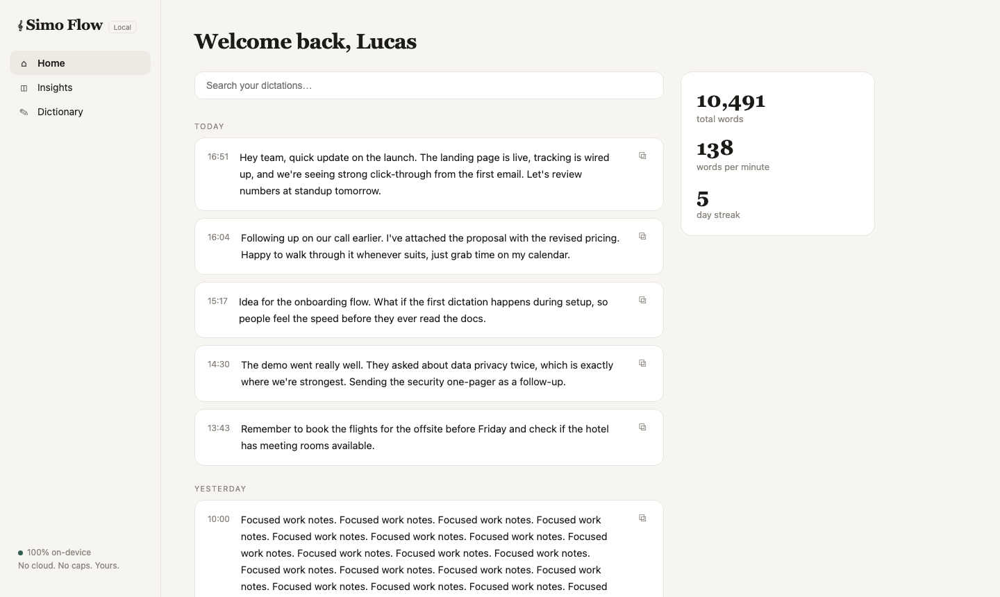
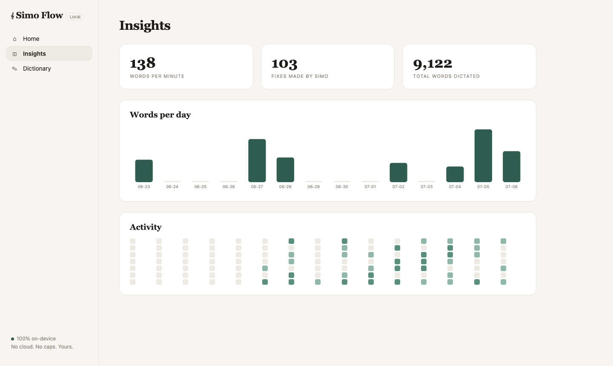

# Simo Flow

[](https://github.com/lucassimonian/simo-flow/actions/workflows/ci.yml)
[](LICENSE)
-black?logo=apple)


**Fully local, offline voice dictation for macOS.** Hold `fn`, speak, release — clean text lands at your cursor in any app. No cloud, no subscription, no weekly word cap. Your voice never leaves your machine.

I built this because I kept hitting [Wispr Flow's](https://wisprflow.ai) free-tier cap. Then I pulled apart its app bundle to see how it worked, and found it does **zero** on-device inference — every word you dictate gets sent to their servers. I didn't love that. So Simo Flow does the whole job on my Mac, and nothing leaves it.

> Full disclosure: I'm not a trained engineer — I work in tech, not software. v1 was built in a day. Then it broke, and rebuilding it *properly* — the backend, the security, the failure handling — is where the real work (and this repo) happened.

```
hold fn ──► mic opens on demand (16kHz) ──► whisper.cpp + Metal
                                                  │ raw transcript
                                                  ▼
                                          Ollama qwen2.5:3b, temp 0
                                                  │ cleaned text
                                                  ▼
                                          clipboard paste + restore
```

Two speed/accuracy tiers, switchable from the menu bar:

| Tier | Model | Warm latency (silence → pasted) | Use it for |
|------|-------|--------------------------------|------------|
| **Accurate** (default) | `large-v3-turbo` | ~1s | Faithful transcription — captures exactly what you said |
| **Fast** | `base.en` | ~600ms | Speed-critical dictation; competitive with Wispr's 700ms cloud target |

The accurate model transcribes disfluencies faithfully; the LLM cleanup pass then removes fillers while preserving your hedges and wording. All on-device, no network hop, no account.





## Features

- 🎙 **Push-to-talk**: hold `fn`, speak, release
- 🔒 **Hands-free lock**: double-tap `fn` to keep recording, tap once to finish
- 🌊 **Frosted-glass recording pill**: real macOS vibrancy with a live voice waveform, ✕ to cancel / ✓ to commit — without stealing focus from the app you're dictating into
- 🎚 **Two model tiers**: Accurate (`large-v3-turbo`) or Fast (`base.en`), switch live from the menu
- ✨ **Clean mode**: removes *um*s and false starts, fixes punctuation — keeps your hedges and wording (the LLM is explicitly forbidden from substituting words)
- 🎯 **Exact mode**: verbatim whisper output, no LLM pass
- 🔴 **Mic indicator only while dictating**: the stream opens on `fn` and closes the instant you finish, so macOS's mic indicator isn't lit while the app sits idle
- 📊 **Dashboard** (`localhost:7331`): history feed with search, WPM / streak / activity insights, and a **Dictionary** that biases the speech model toward your names and jargon
- 🗄 Everything stored in a local SQLite you own (`~/.simo-flow.db`, `0600`)

## Install

```bash
brew install whisper-cpp ollama portaudio ffmpeg
brew services start ollama
ollama pull qwen2.5:3b-instruct

git clone https://github.com/lucassimonian/simo-flow && cd simo-flow
python3.11 -m venv .venv
./.venv/bin/pip install -r requirements.txt

# whisper models — the default "Accurate" tier plus the "Fast" fallback
curl -L -o models/ggml-large-v3-turbo-q5_0.bin \
  https://huggingface.co/ggerganov/whisper.cpp/resolve/main/ggml-large-v3-turbo-q5_0.bin
curl -L -o models/ggml-base.en.bin \
  https://huggingface.co/ggerganov/whisper.cpp/resolve/main/ggml-base.en.bin

# install as a login agent (starts now + at every login, auto-restarts if it dies)
./simo install
```

`./simo` controls the app: `install`, `uninstall`, `start`, `stop`, `restart`, `status`, `log`.

**First run** — grant **Microphone**, **Accessibility**, and **Input Monitoring** to the app's Python binary (`.venv/bin/python3.11`) in System Settings → Privacy & Security, then `./simo restart`. The menu-bar icon shows ⚠️ and deep-links you to the right pane until both are granted. Also set System Settings → Keyboard → **"Press 🌐 key to" → "Do Nothing"** so macOS doesn't fight over the key (Wispr Flow requires the same).

Prefer to run it in the foreground instead of as an agent? `./.venv/bin/python -m engine`.

## Engineering notes

Things that turned out to matter, in the order they bit me:

1. **Don't stream — batch.** Continuous transcription with live-correcting text is where naive Whisper dictation clones die (flicker, re-typing, repetition artifacts). Push-to-talk bounds the utterance; one paste on release deletes the whole problem class. Every serious open-source clone converges on this.
2. **A silent failure is worse than a crash.** The app once started pasting `[end of transcript]` — Whisper's output for silence — because the mic device had changed and the always-open stream was feeding zeros, and every error was printing to a terminal that had been closed. The fix wasn't the mic: it was that the app had no health monitoring and failed invisibly. Now the mic opens fresh per utterance, an RMS check refuses to send silence downstream, junk transcripts are never pasted, failures surface in the pill, and logs tee to `~/.simo-flow.log`.
3. **Open the mic on demand, not at launch.** Holding the stream open keeps macOS's microphone indicator lit the whole time the app runs — which, for a privacy-first tool, wrongly reads as "always listening." Opening on `fn` and closing on release matches Wispr and keeps the indicator honest. macOS opens the device in ~100ms, hidden by the pause between pressing and speaking.
4. **Accurate ASR looks "worse" until you see the pipeline.** `base.en` drops fillers — and real words with them. `large-v3-turbo` faithfully captures *"um, so basically I think…"*, which looks messier but is more accurate; the LLM pass then removes only the fillers. Feed the polish step the honest transcript, not a lossy one.
5. **Serialize the pipeline or corrupt the clipboard.** Two quick back-to-back dictations spawned two pipeline threads racing on the single system clipboard — you could paste the wrong utterance. A single worker queue processes commits in order; paste is never concurrent.
6. **3B models over-edit.** `qwen2.5:3b` treats hedges ("basically", "I think") as fillers. The fix: "never substitute — every kept word must appear verbatim", a named hedge list to *keep*, and one few-shot example (the highest-leverage lever for a small model).
7. **The `fn` key is contested territory.** macOS binds it to the emoji picker, Apple Dictation wants it, and a stale Character Palette window will silently swallow your pasted text via key focus. A HID-level consuming event tap + one system setting resolves it.
8. **Localhost isn't automatically private.** The dashboard binds `127.0.0.1`, but a webpage you visit can still reach it: forged cross-origin writes, and DNS-rebinding to read `/api/history`. Both are closed with Origin + Host header checks. For an app whose promise is "your words never leave the machine," the read path had to be shut, not just the writes.
9. **`pkill -f "python ..."` doesn't match a venv GUI process on macOS** — the venv execs the framework `Python.app` binary (capital P). And `launchctl` paths don't inherit your shell `PATH`, so `whisper-server` has to be resolved by absolute path.

## Layout

```
engine/__main__.py   menu-bar app, fn state machine, serialized pipeline worker, shutdown hooks
engine/hotkey.py     HID-level consuming CGEventTap
engine/audio.py      on-demand mic capture, silence trim + silence guard
engine/stt.py        whisper-server client + tiers, health-check/restart, orphan reaping
engine/polish.py     LLM cleanup with word-preservation constraints + hedge few-shot
engine/inject.py     clipboard set → Cmd+V → restore (non-text-safe)
engine/store.py      SQLite (0600): history, dictionary, settings, insights
engine/api.py        FastAPI on 127.0.0.1:7331 — Origin + Host guarded, zero external calls
engine/static/       the dashboard (single self-contained HTML file, iCloud aesthetic)
engine/overlay.py    the recording pill (NSVisualEffectView + live waveform)
simo                 control script + LaunchAgent (install/start/stop/restart/status/log)
tests/               assert-based per-module self-checks + full E2E
```

Every module runs standalone as its own self-check: `./.venv/bin/python -m engine.stt` etc.

## Testing

Two layers, split by what they need:

- **Unit tests** (`tests/test_units.py`) — pure logic with no mic, server, or GUI: the silence guard, junk-transcript filter, transcript dedupe, the SQLite store, and the dashboard's `Origin`/`Host` security guards. These run in CI on every push.
- **End-to-end** (`tests/test_pipeline.py`) + per-module self-checks — exercise the real mic → whisper → Ollama → paste path, so they need the hardware and servers and run locally, not in CI.

```bash
./.venv/bin/python -m pytest tests/test_units.py -q
```

## Limitations

Being honest about what this is and isn't:

- **Apple Silicon, macOS 14+ only.** The Metal acceleration and the `fn`-key event tap are Mac-specific; there's no Intel or non-Mac build.
- **Run from source, not a signed app.** You clone and run it — deliberately, so you can audit exactly what gets your mic and accessibility access before granting them. There's no notarized `.dmg` yet, so there's no double-click installer.
- **First-run permission friction.** macOS ties Input Monitoring / Accessibility / Microphone to the Python binary; you grant them once, and re-creating the venv resets them.
- **Needs Ollama running** for Clean mode (Exact mode works without it).
- **~3.5GB of models** on disk (turbo + base.en + the 3B LLM).
- **The first dictation after launch** is ~0.5s slower than the rest (macOS activating the mic the first time); every subsequent one is fast.

## Contributing & feedback

Simo Flow is meant to be used, forked, and improved. If you're running it and hit a rough edge, or you've got an idea that would make it better, **open an issue** — I read every one. PRs welcome, especially around new model tiers, accuracy, and macOS packaging.

## Requirements

Apple Silicon Mac, macOS 14+, ~3.5GB disk (turbo + base.en models + 3B LLM). Built and benchmarked on a MacBook Air M5.

## License

MIT
